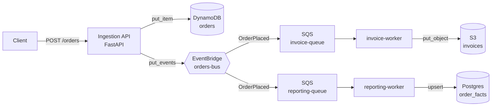

# floci-order-pipeline

An event-driven order pipeline that runs on top of [Floci](https://floci.io), a local
AWS emulator. DynamoDB, EventBridge, SQS, and S3 are all emulated, with a Postgres
read-model alongside them. The whole project, integration tests included, runs in CI
without an AWS account, credentials, or a cloud bill.

`docker compose up` gets you a working AWS-shaped system on your laptop.

## Architecture



An EventBridge rule matches `OrderPlaced` and fans it out to two SQS queues. One
worker renders an invoice to S3, the other keeps a denormalized fact table in
Postgres for reporting. Delivery is idempotent, so redelivered messages don't
create duplicate rows.

## Quickstart

```bash
cp .env.example .env
make up          # Floci + Postgres + API + both workers
make seed        # POST a sample order
make logs        # watch it flow through
```

Check the results with the AWS CLI, pointed at Floci:

```bash
export AWS_ENDPOINT_URL=http://localhost:4566
aws dynamodb scan --table-name orders
aws s3 ls s3://invoices/invoices/
```

Or query the read-model directly:

```bash
docker compose exec postgres psql -U floci -d reporting -c 'select * from order_facts;'
```

## Testing

```bash
poetry install
make test
```

`tests/` has two layers:

- `test_models.py` — pure unit tests for money math and invoice rendering, no
  containers, runs in milliseconds.
- `test_pipeline.py` — integration tests using
  [Testcontainers](https://testcontainers.com/modules/floci/). Boots a real Floci
  container and a real Postgres container, runs `bootstrap` to provision
  resources, then drives the actual pipeline: post an order, check it lands in
  DynamoDB, check the event fans out to both queues, run each worker, check the
  S3 object and the Postgres row.

This same suite runs on every push via
[`.github/workflows/ci.yml`](.github/workflows/ci.yml). GitHub's Linux runners
have Docker, so Floci comes up in CI the same way it does locally.

## Project layout

```
src/order_pipeline/
  config.py            settings (env-overridable endpoint: Floci <-> real AWS)
  aws.py               boto3 factory — the one place the endpoint is wired
  models.py            pydantic domain models (money in integer cents)
  api/main.py          FastAPI ingestion endpoint
  repository/
    orders.py          DynamoDB persistence
    reporting.py       Postgres read-model (idempotent upsert)
  events/publisher.py  EventBridge publisher
  workers/
    invoice_worker.py  SQS -> S3
    reporting_worker.py SQS -> Postgres
infra/bootstrap.py     idempotent resource provisioning
tests/                 unit + Testcontainers integration tests
```

## Design notes

- Nothing in the app code knows about Floci specifically. Drop
  `AWS_ENDPOINT_URL` and the same code talks to real AWS.
- Money is stored as integer cents everywhere, so no floats cross the JSON /
  DynamoDB / Postgres boundaries.
- `bootstrap` is safe to re-run, and the reporting upsert tolerates SQS
  at-least-once redelivery.

## Extending it

Floci also emulates Lambda, RDS, Step Functions, and more. Some natural next
steps: package the workers as Lambda functions triggered by the SQS queues, add
a Step Functions saga for multi-step fulfillment, or provision the Postgres
read-model through Floci's RDS instead of a standalone container (the
docker.sock mount for that is already in place).

## License

MIT
