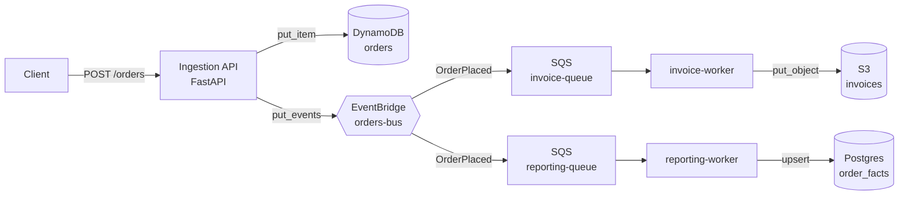

# floci-order-pipeline

An event-driven order pipeline where **the entire AWS surface is emulated
locally by [Floci](https://floci.io)** — DynamoDB, EventBridge, SQS, and S3 — with
a Postgres read-model on the side. The interesting part isn't the services; it's
that the whole thing, including a full integration test suite, **runs in CI with
no AWS account, no credentials, and no cloud bill.**

Clone it, `docker compose up`, and you have a working AWS-shaped system on your
laptop in under a minute.

## Architecture



A single EventBridge rule matches `OrderPlaced` and fans it out to two SQS
queues. One worker renders an invoice to S3; the other maintains a denormalised
fact table in Postgres (the "analytics read-model"). Delivery is idempotent, so
re-delivered messages don't duplicate rows.

## Quickstart

```bash
cp .env.example .env
make up          # Floci + Postgres + API + both workers
make seed        # POST a sample order
make logs        # watch it flow through
```

Then look at the results directly through the AWS CLI, pointed at Floci:

```bash
export AWS_ENDPOINT_URL=http://localhost:4566
aws dynamodb scan --table-name orders
aws s3 ls s3://invoices/invoices/
```

Or hit the read-model:

```bash
docker compose exec postgres psql -U floci -d reporting -c 'select * from order_facts;'
```

## Testing — the point of the whole thing

```bash
poetry install
make test
```

`tests/` has two layers:

- **Pure unit tests** (`test_models.py`) — money math and invoice rendering,
  no containers, run in milliseconds.
- **Integration tests** (`test_pipeline.py`) — [Testcontainers](https://testcontainers.com/modules/floci/)
  boots a real Floci container and a real Postgres container, `bootstrap`
  provisions the resources, and the tests drive the actual pipeline: post an
  order, assert it lands in DynamoDB, assert the event fans out to both queues,
  run each worker, assert the S3 object and the Postgres row.

The same suite runs on every push via [`.github/workflows/ci.yml`](.github/workflows/ci.yml).
GitHub's Linux runners have Docker, so Floci comes up in CI exactly as it does
locally — **the tests exercise AWS-shaped services without ever touching AWS.**

## Project layout

```
src/order_pipeline/
  config.py            settings (env-overridable endpoint: Floci <-> real AWS)
  aws.py               boto3 factory — the one place the endpoint is wired
  models.py            pydantic domain models (money in integer cents)
  api/main.py          FastAPI ingestion endpoint
  repository/
    orders.py          DynamoDB persistence
    reporting.py       Postgres read-model (idempotent upsert)
  events/publisher.py  EventBridge publisher
  workers/
    invoice_worker.py  SQS -> S3
    reporting_worker.py SQS -> Postgres
infra/bootstrap.py     idempotent resource provisioning
tests/                 unit + Testcontainers integration tests
```

## Design notes

- **One endpoint switch, two environments.** Nothing in the app code knows about
  Floci. Drop `AWS_ENDPOINT_URL` and the identical code talks to real AWS.
- **Money as integer cents** everywhere — no floats crossing JSON / DynamoDB /
  Postgres boundaries.
- **Idempotent by construction** — `bootstrap` is safe to re-run, and the
  reporting upsert tolerates SQS at-least-once redelivery.

## Extending it

Floci also emulates Lambda, RDS, Step Functions, and more. Natural next steps:
package the workers as Lambda functions triggered by the SQS queues; add a Step
Functions saga for multi-step fulfillment; provision the Postgres read-model
through Floci's RDS instead of a standalone container (uncomment the docker.sock
mount is already there for the Lambda/RDS extensions).

## License

MIT
